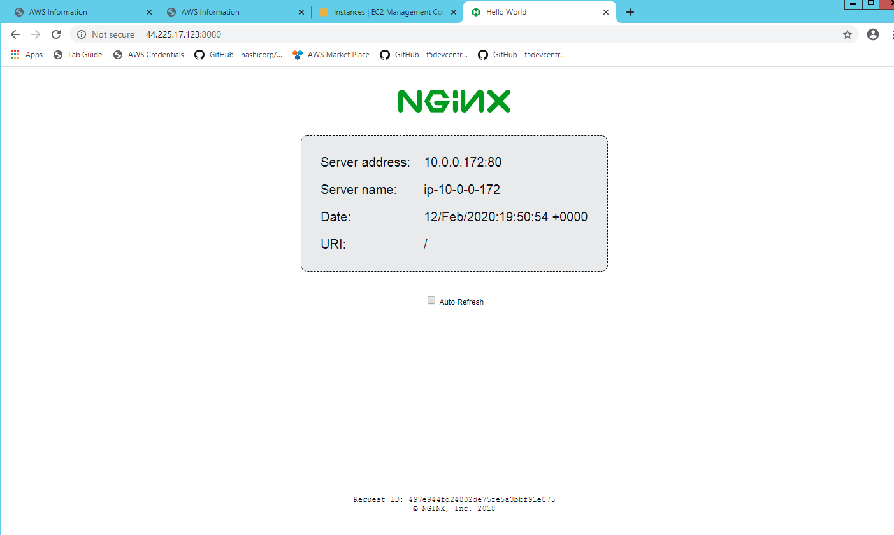

Test backend application #11
============================
- How to  test end to end traffic?

Open the browser and issue the following command on the browser

.. code-block:: shell

  http://BIG-IP-Virtual_IP:8080

here the BIG-IP-Virtual_IP is the Management IP of BIG-IP, notice the port we are using now to connect to the back end application is "8080"

You shoud get a response as shown below from the nginx server

