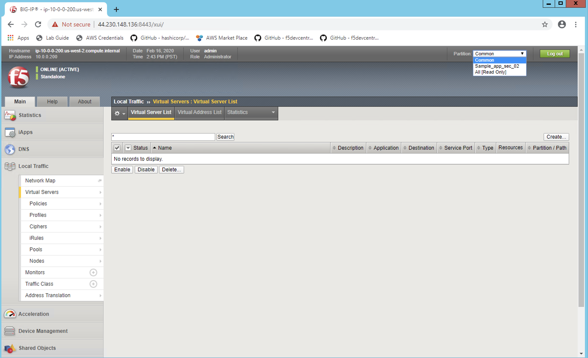
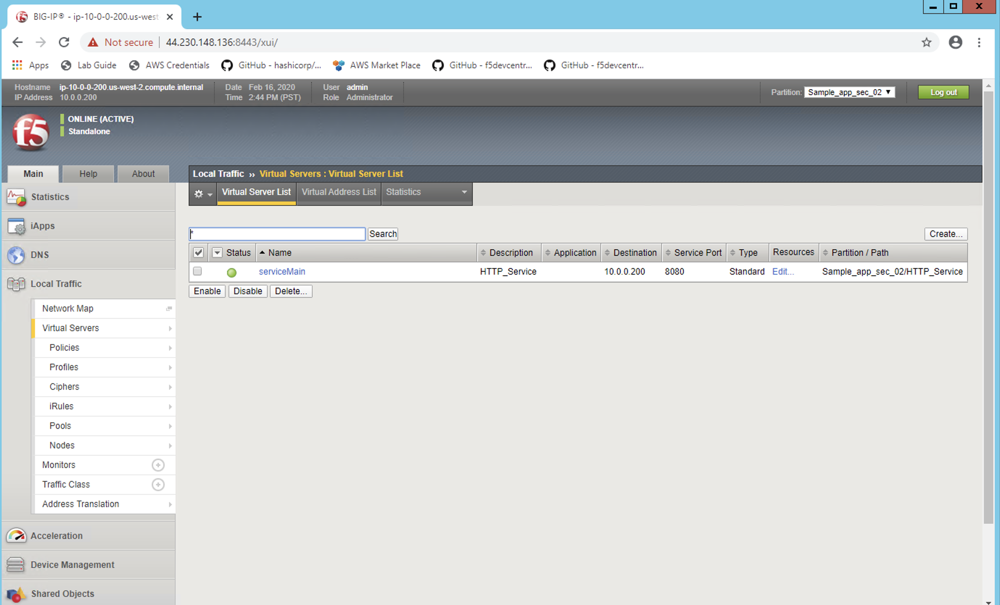
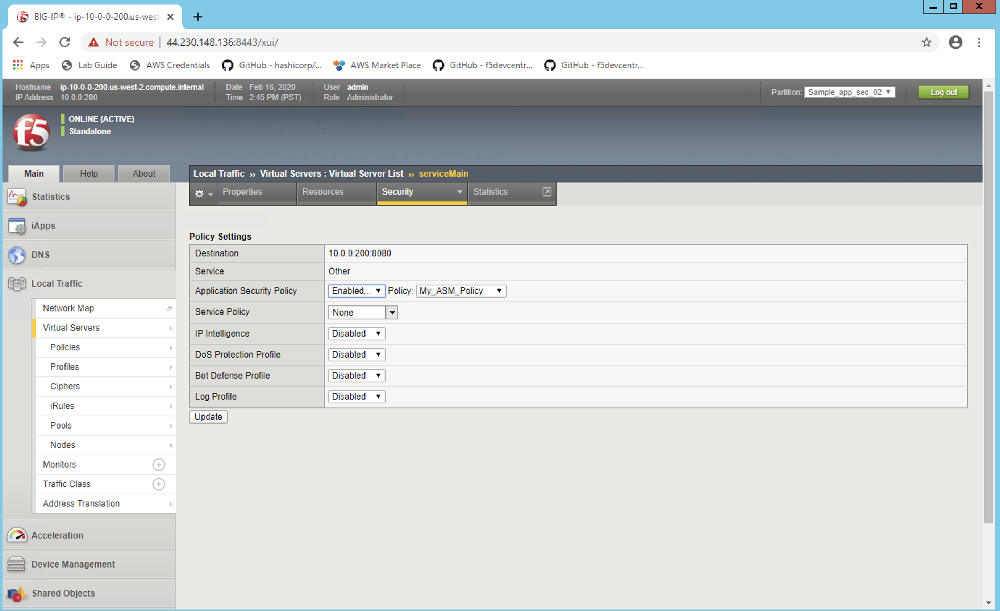
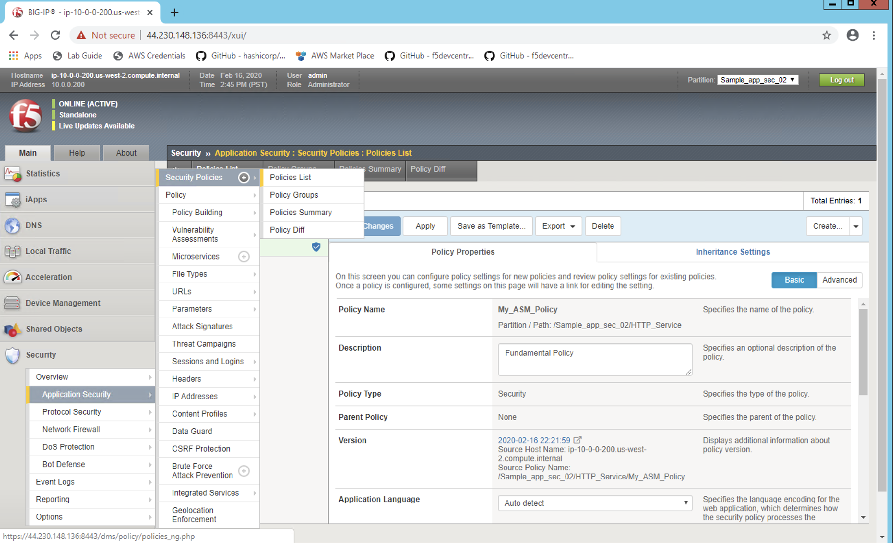
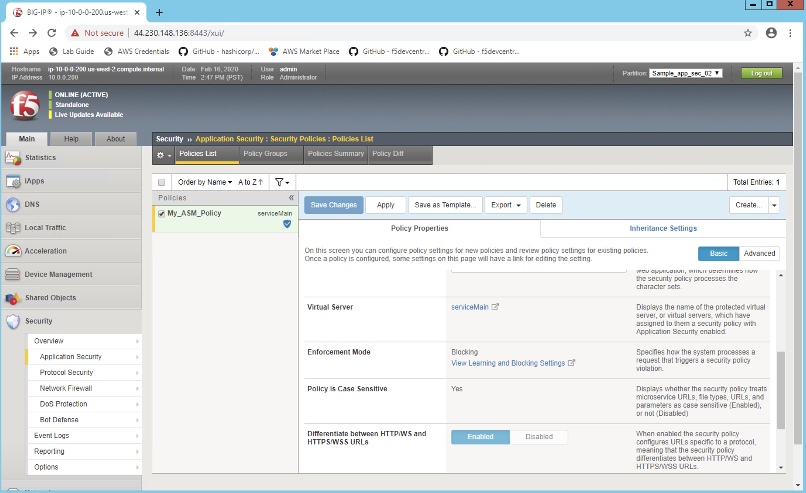
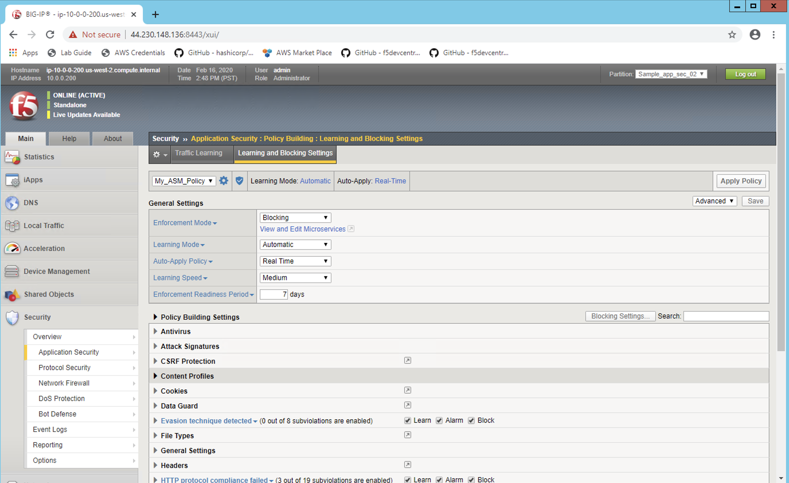

Lets see the configuration on BIG-IP  #17  
========================================
- cat file terraform.tfvars

.. code-block:: shell

  cat terraform.tfvars

Copy the BIG-IP Management IP
OPen the browser and https://address:8443 and login with admin/password

 

 
.. Note:: After doing terraform apply we should have 4 resources created again. 

