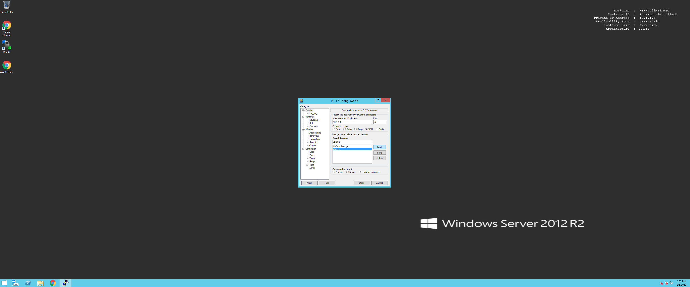
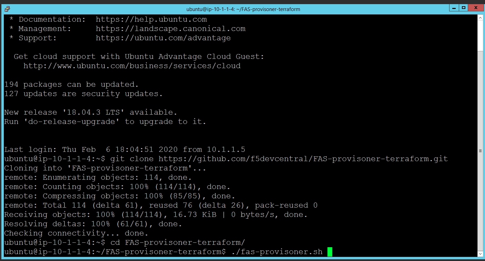

Login to ubuntu & Clone
=======================

Open up Putty on the Windows 2012 device and select the ubuntu host.

On the ubuntu host run the following command.

.. code-block:: shell
   
  $ git clone https://github.com/f5devcentral/FAS-provisoner-terraform.git
  $ cd FAS-provisoner-terraform
  $ ./fas-provisoner.sh

.. warning:: If you see an error "OptInRequired" you will need to go to the
   step 2 again to resolve this error.

The first step "init" is fetching providers or plug-ins that will be used to
connect to AWS. The script will create a jump box, spin instance of BIG-IP VE 
and 2 instances of nginx servers in AWS VPC.

"plan" will output actions that terraform will perform (dry-run).

"apply" will execute the actions.
